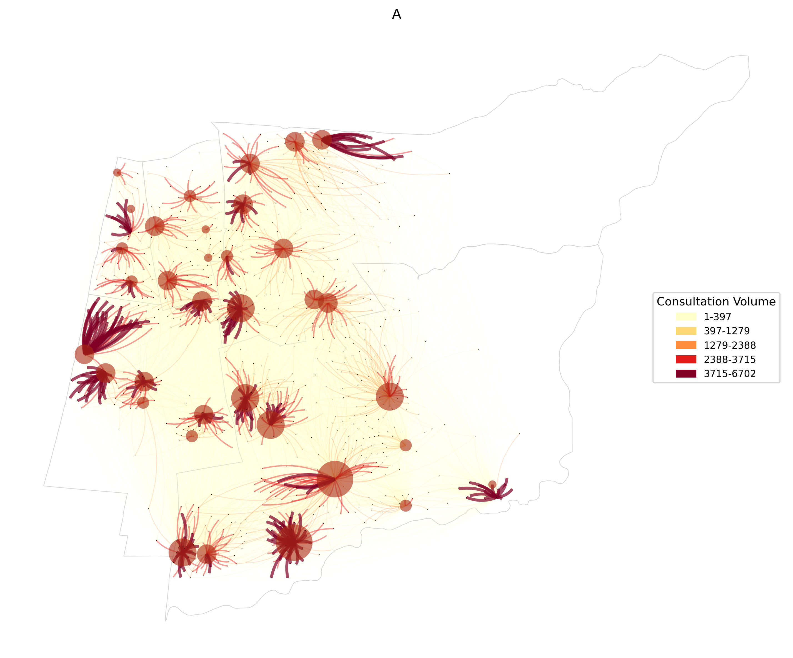

# GIS Dissertation

This repository contains the code, and documentation for my MSc dissertation titled:  
<h2 align="center">Application of Multiscale Community Detection Methods for Delineating Primary Care Service Areas in Chile </h2>

<details>
  <summary><strong> Abstract </strong></summary>

Patient choice in Chile’s primary healthcare system challenges equitable service allocation, as individuals may seek care beyond their local area. To better capture these travel patterns, a novel multi-scale methodology was developed to delineate Primary Care Service Areas (PCSAs), supporting the identification of potential service misalignments.

Geocoded 2023 patient consultation data were aggregated across multiple spatial scales to construct weighted networks using three schemes. To identify the most effective approach for capturing care-seeking patterns, three community detection algorithms—Louvain, Leiden, and Infomap—were evaluated based on their ability to delineate service areas for most health centres in the study region. Finally, two spatial enforcement methods were then applied to ensure the resulting areas were contiguous and suitable for practical use.

Infomap outperformed modularity-based methods, producing 39 service areas with a mean localisation index of 0.68. In addition, the proposed spatial enforcement method—based on strongest connections—proved faster while delivering delineations of comparable quality to the existing approach.

A case study estimated Standardised Relative Access Ratios (SRARs) for public and private services, revealing spatial disparities. The most common pattern involved PCSAs compensating for limited private access with public care, while others faced compounded access challenges. These findings highlight potential misalignments between patient demand and service capacity.

The proposed methodology provides a reproducible approach to representing care-seeking patterns through behaviourally informed service areas. Building on this, advances in GeoAI could support boundary redesign by integrating area-level attributes into network models, offering a path toward more responsive and equitable healthcare planning.

<br>
Keywords: Community Detection Algorithms, Primary Care Service Areas (PCSAs), Localisation Index (LI), Contiguity Enforcement Strategies 

</details>


<h3 align="center">Multiscale Community Detection Workflow</h3>
<p align="center">A) Stage 1: Data Preparation, B) Stage 2: Multi-Scale Regionalisation Process, C) Stage 3: Community Detection, D) Stage 4: Model Assessment</p>
<p align="center">
  
</p>


## Example Workflow

<details>
  <summary><strong> Step 1: Combine and Standardise Chilean Census Polygons </strong></summary>

To replicate the first step of **Stage 1**, execute the following script:

```python
python multipart_relabeller.py -u manzanas_apc_2023.shp -r \
microdatos_entidad.zip -o processed_polygons.parquet
```

This will merge and standardise the raw urban and rural census polygons found in the `data/raw` directory and create a spatial file called `processed_polygons.parquet`, saved in `data/processed`.

</details>

<details>
  <summary><strong> Step 2: Generate Voronoi polygons constrained by regional boundaries </strong></summary>

  Default command:

  By default, the region is divided into chunks using intermediate regional boundaries. This partitioning enables the creation and processing of Voronoi diagrams in parallel.

  ```python
  python voronoi_polys.py -i processed_polygons.parquet -r COMUNA_C17.shp
  ```
- `-i`: Input processed polygons shapefile from the previous step

- `-r`: Region boundary shapefile

- `-b`: Barrier layer shapefile (e.g., hydrographic network)

- `-o`: Output Voronoi GeoPackage file

*Note*: Each Voronoi polygon set for a region is stored as a separate layer within the GeoPackage file.
Additionally, a combined Voronoi layer that merges all specified regions is saved in the same GeoPackage under the layer name `"combined"`. The same behaviour applies to hidden polygons detected during the Voronoi generation process: they are exported as separate layers and also merged into a combined layer within a separate GeoPackage file.

__Additional arguments:__

To disable specific behaviours—such as processing regions in chunks—and explore other options, run:

 ```python
  python voronoi_polys.py --help
 ```
For more advanced fine-tuning, including parameters like buffer sizes and boundary simplification tolerance levels, refer directly to the class implementation in [`voronoi_processor.py`](polygon_processors/voronoi_processor.py). Examples of visual outputs generated with various parameter settings can be found in the [`notebooks`](notebooks) directory.

</details>

<details>
  <summary><strong> Step 3: Calculate Voronoi attributes</strong></summary>
  This step generates the population estimates and socioeconomic group counts for each polygon based on point locations. These processed attributes and polygons serve as input for the AZTool software, supporting its aggregation process by enabling constraints that promote a certain level of socioeconomic homogeneity.

  __Default command__

  It is recommended to start by running the following command to visualise the population distribution, as some Voronoi polygons may contain significantly higher populations than others.
  ```python
  python calculate_attributes.py -vi combined -pi phc_consultations_2023.csv
 ```
- `-vi`: Path to input file containing Voronoi polygons (a layer within a GeoPackage)

- `-pi`: Input data with latitude and longitude columns (CSV or spatial format)

__Splitting High-Population Polygons__

To automatically split polygons that exceed a predefined population threshold, use the `--split-polygons` flag:

  ```python
  python calculate_attributes.py -vi combined -pi phc_consultations_2023.csv --split-polygons
  ```
When this option is enabled, the script applies a method that slightly shifts overlapping points within a specified distance buffer. This helps minimise artefacts caused by high-density buildings or stacked population points, while ensuring that the shifted points remain within their original containing polygon.

__Output Files__

By default, the output files are saved in Shapefile format, as required by the AZTool software. Depending on whether polygon splitting is enabled, the main output will be:

- `voronoi_data.shp` – when no splitting is applied

- `voronoi_data_split.shp` – when the `--split-polygons` option is used

In addition, the script also generates Shapefiles containing the point data used for the estimation process. These files help verify which population points were considered in the analysis.

__Additional arguments__

To view all available parameters—including the default population threshold for splitting and paths to socioeconomic datasets—run:

 ```python
  python calculate_attributes.py --help
 ```

</details>

<details>
  <summary><strong> Step 4: Create Tracts</strong></summary>

This step requires downloading the `AZtool (version 1.0.3 25/8/11)` and `AZImporter (version 1.0.1 20/10/10)` software from the [`oficial website`](https://aztool.geodata.soton.ac.uk/download/). Place each tool's directory within your project folder.

Then follow these steps:
1. Run the `AZImport.exe` file from the `AZImporter` directory.
 Use either `voronoi_data.shp` or `voronoi_data_split.shp` as input, and set the output to `voronoi.aat`, saving it within the `AZTool` directory.

2. 

  __Default command__ 
  ```python
  python create_tracts.py -i voronoi_data_split.shp -azt voronoi.pat
 ```
- `-i`: Path to the input file containing processed Voronoi polygons used as building blocks.

- `-azt`: Filename of AZTool Building Block IDs.

- `-o`: Output GeoPackage filename containing the resulting Tracts.

</details>


<br><br>

<p align="center">
  
</p>
