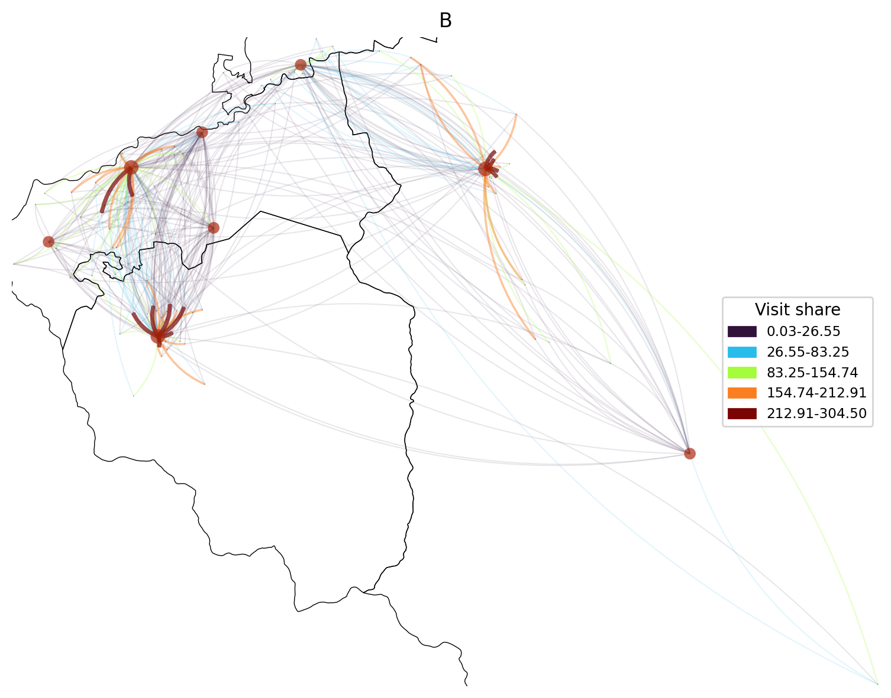

# Primary Care Service Area Delineation Using Multiscale Community Detection in Chile

This repository contains the code and documentation for the research titled:
<h2 align="center">Application of Multiscale Community Detection Methods for Delineating Primary Care Service Areas in Chile</h2>

<details>
  <summary><strong> Abstract </strong></summary>

Patient choice in Chile’s primary healthcare system challenges equitable service allocation, as individuals may seek care beyond their local area. To better capture these travel patterns, a novel multi-scale methodology was developed to delineate Primary Care Service Areas (PCSAs), supporting the identification of potential service misalignments.

Geocoded 2023 patient consultation data were aggregated across multiple spatial scales to construct weighted networks using three schemes. To identify the most effective approach for capturing care-seeking patterns, three community detection algorithms—Louvain, Leiden, and Infomap—were evaluated based on their ability to delineate service areas for most health centres in the study region. Finally, two spatial enforcement methods were then applied to ensure the resulting areas were contiguous and suitable for practical use.

Infomap outperformed modularity-based methods, producing 39 service areas with a mean localisation index of 0.68. In addition, the proposed spatial enforcement method—based on strongest connections—proved faster while delivering delineations of comparable quality to the existing approach.

A case study estimated Standardised Relative Access Ratios (SRARs) for public and private services, revealing spatial disparities. The most common pattern involved PCSAs compensating for limited private access with public care, while others faced compounded access challenges. These findings highlight potential misalignments between patient demand and service capacity.

The proposed methodology provides a reproducible approach to representing care-seeking patterns through behaviourally informed service areas. Building on this, advances in GeoAI could support boundary redesign by integrating area-level attributes into network models, offering a path toward more responsive and equitable healthcare planning.

<br>
Keywords: Community Detection Algorithms, Primary Care Service Areas, Localisation Index, Health Planning, Healthcare Accessibility

</details>

<details>
<summary><strong> Study Area </strong></summary>

<p align="center">
  
</p>

</details>

<h3 align="center">Multiscale Community Detection Workflow</h3>
<p align="center">A) Stage 1: Data Preparation, B) Stage 2: Multi-Scale Regionalisation Process, C) Stage 3: Community Detection, D) Stage 4: Model Assessment</p>
<p align="center">
  
</p>

## Data Availability

The dataset for this project is hosted on Zenodo (pending upload):
**[Download from Zenodo](https://zenodo.org/record/XXXXXXX)**

The Zenodo repository contains the following folders:

- `raw/` – Original, unprocessed data files.  
- `processed/` – Cleaned and prepared datasets used for analysis.  
- `AZImporter/` – AZImporter (version 1.0.1 20/10/10) software downloaded from [AZTool official website](https://aztool.geodata.soton.ac.uk/download/).  
- `AZTool/` – AZTool (version 1.0.3 25/8/11) software downloaded from [AZTool official website](https://aztool.geodata.soton.ac.uk/download/), including:
  - `voronoi.aat` and `voronoi.pat` files created using AZImporter.
  - 14 XML files with the parameters used to run the algorithm.
  - A batch file to run all configurations sequentially.
  - The 14 CSV outputs generated by AZTool.

**Instructions:** After downloading, place the `raw/` and `processed/` folders inside the `data/` directory, and place the `AZImporter/` and `AZTool/` folders directly in the main project directory.

## Environment Setup

This project includes a Conda environment configuration file.

**Note**: The environment has been tested on Ubuntu. Compatibility with Windows or other operating systems is not guaranteed.

To create the environment, run:

```bash
conda env create -f environment_3_11.yml
```

Then activate it:

```bash
conda activate <environment_name>
```

## Example Workflow

<details>
  <summary><strong> Step 1: Combine and Standardise Chilean C`ensus Polygons </strong></summary>

To replicate the first step of **Stage 1**, execute the following script:

```python
python multipart_relabeller.py -u manzanas_apc_2023.shp -r \
microdatos_entidad.zip -o processed_polygons.parquet
```

This will merge and standardise the raw urban and rural census polygons found in the `data/raw` directory and create a spatial file called `processed_polygons.parquet`, saved in `data/processed`.

</details>

<details>
  <summary><strong> Step 2: Generate Voronoi polygons constrained by regional boundaries </strong></summary>

This step generates Voronoi diagrams for the seven communes in the study area. The process is parallelised across 12 CPU cores by dividing each commune into intermediate areas.

To view available options and default parameters, run:

```python
 python voronoi_polys.py --help
```

To execute the default process:

```python
 python voronoi_polys.py -i processed_polygons.parquet -r COMUNA_C17.shp
```

This will generate a file named `voronoi.gpkg` containing:

- One layer per commune with constrained Voronoi diagrams.
- A combined layer that merges all commune-level Voronoi polygons.

Two Jupyter notebooks located in the `notebooks` directory provide supporting context:

- [`polygon_prep.ipynb`](./notebooks/polygon_prep.ipynb) documents geoprocessing steps and parameter testing before and after Voronoi generation.
- [`hidden_polys.ipynb`](./notebooks/hidden_polys.ipynb) shows how the `VoronoiProcessor` class handles hidden polygons.

</details>

<details>
  <summary><strong> Step 3: Calculate Voronoi attributes</strong></summary>

This step concludes **Stage 1**. It involves estimating population counts and socioeconomic groupings for each polygon based on point-level data. These enriched polygons were used as input for the AZTool software.

Although the original script `calculate_attributes.py` was used to perform this step, it cannot be run due to the use of confidential geocoded data. For demonstration purposes, the notebook [`split_polys.ipynb`](./notebooks/split_polys.ipynb) reproduces the logic using synthetic data.

The resulting shapefiles are stored in `data/processed`:

`voronoi_data.shp`: attributes calculated on full polygons.

`voronoi_data_split.shp`: attributes recalculated after polygon splitting.

To explore the resulting population distribution, use the notebook [`pop_distribution.ipynb`](./notebooks/pop_distribution.ipynb).

</details>

<details>

  <summary><strong> Step 4: Tract Generation (AZTool)</strong></summary>

This step forms **Stage 2** of the workflow and involves using AZTool to generate 14 tract outputs.

Because AZTool is a Windows-based application (written in VB.NET), this step must be performed in a Windows environment.

Instructions:

1. Copy the `AZTool` and `AZTImporter` folders to a Windows session (e.g. Desktop).

2. Open the `AZTImporter` folder and run `AZTImport.exe`.

3. In the GUI:

 - Set `voronoi_data_split.shp` (from `data/processed`) as the input shapefile.

 - Save the output AAT file as `voronoi.aat` inside the `AZTool` folder.

Next, go to the `AZTool` folder, which contains 14 XML files, each corresponding to a different tract configuration. The `AZTool_M.exe` executable can be used to process each configuration, but for convenience, a batch script `Run_AZTool_M.bat` is provided.

Open `Run_AZTool_M.bat` in a text editor and ensure that the `BASE` path variable matches the actual location of the AZTool folder.

Running the batch file will sequentially execute all 14 XML configurations and produce CSV files in the format `TractOutput_%%S.csv`, where `%%S` refers to the target population.

Once completed, copy the `AZTool` folder back into your Linux session.

To generate the final Tract outputs by dissolving the Voronoi polygons based on AZTool assignments, run the following command in the same terminal:

```python
 python create_tracts.py -i voronoi_data_split.shp -azt voronoi.pat
```
By default, the script will iterate over each CSV file containing tract assignments and create individual layers within a `tracts.gpkg` file. Each layer will be named using the format `tracts_<TARGET_POP>`.

Additionally, a summary file named `tracts_summary.xlsx` will be generated, containing key statistics for each tract configuration.

</details>

<details>
  <summary><strong> Step 5: Community detection Pipeline</strong></summary> 

The following script replicates the parameter grid search described in the research paper. To reproduce the process using the provided pre-calculated matrix, run:

```python
 python run_models.py -m matrices.parquet --pop-values 1000
```

To inspect the available parameters and options, use:

```python
 python run_models.py --help
```

Several Jupyter notebooks are available in the `notebooks` folder to assist with analysing the outputs using the developed Python classes:

- [`flow_networks.ipynb`](./notebooks/flow_networks.ipynb)
Generates flow graphs based on the pre-computed matrix.

- [`pcsa.ipynb`](./notebooks/pcsa.ipynb)
Illustrates how the selected community detection output is used to dissolve tracts and form the final Primary Care Service Areas (PCSAs). It also includes the calculation of the Localisation Index for each service area.

- [`spatial_enforcement.ipynb`](./notebooks/spatial_enforcement.ipynb)
Compares the two spatial enforcement strategies alongside the default community detection output.

</details>

<br><br>

<p align="center">
  
</p>

<p align="center">
  
</p>

Patient flow networks to PHC centres in urban (A) and rural (B) Communes, aggregated by
tracts averaging 1,000 patients. Consultation volumes are classified into five Natural Breaks categories.
Nodes mark tract centroids and grey lines show Commune boundaries. Red circles represent PHC
centres, with their size varying according to the total number of consultations received.